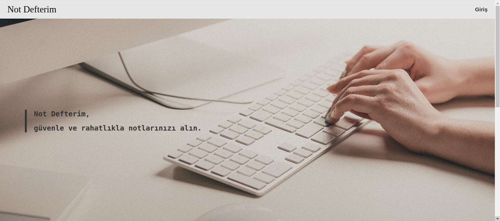
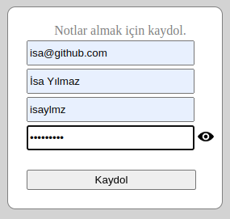
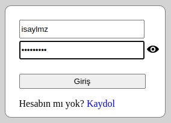
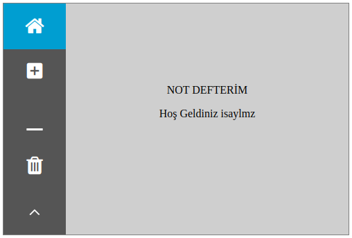
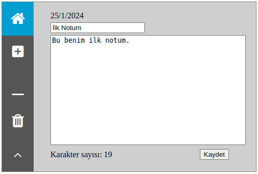
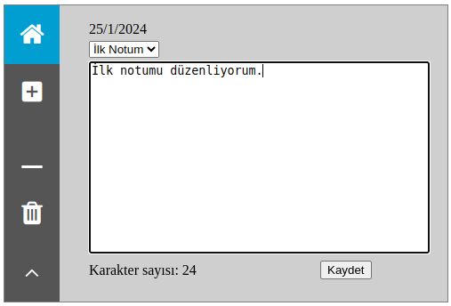
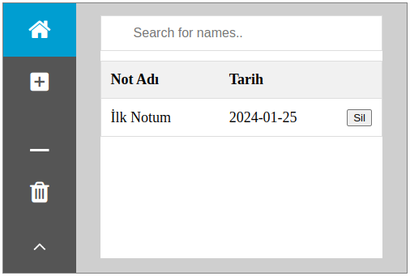

* '**notdefterim.sql**' dosyasını kullanarak uygulamaya ait veri tabanını içe aktarabilirsiniz.

* Veri tabanı bağlanma bilgilerini "NotDefterim/conn.php" dosyasından değiştirebilirsiniz.

$servername = "localhost";  
$username = "root";  
$password = "";  
$database = "notdefterim";

---
### -- Ana Sayfa --

---
### -- Kaydol --

**Çıktı:** Kayıt başarıyla geçekleştirildi.!

---
### -- Giriş  --

---
### -- Kullanıcı Paneli --

---
### -- Not Ekleme --

**Çıktı:**  

---
### -- Not Düzenleme --

---
### -- Not Silme --

**Çıktı:** Hiç kayıt bulunmamaktadır. Kayıt sayısı:0
